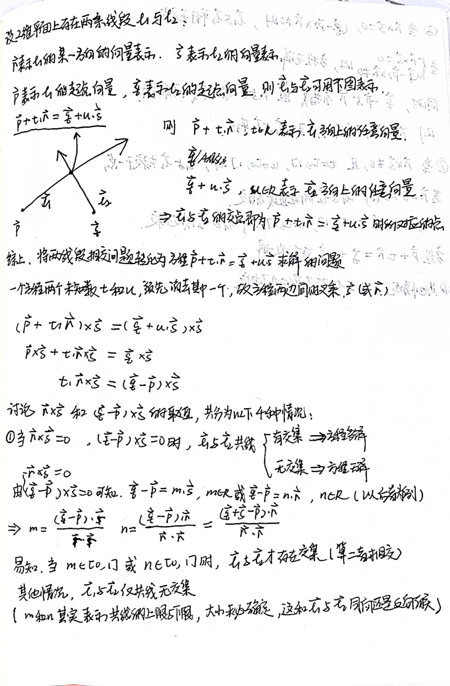

# 
两条线段相交问题

分别从数学角度和代码层面讨论如何判断两条直线是否相交

## 1. 引言
为什么会谈到“如何判断两条线段是否相交”这个问题呢？
这其实是PCIA项目中延伸出来的一个问题，在计数阶段使用一种算法来判断目标是否通过检测线，自然就要涉及这样的问题。
当初调研了一些算法，找到了一个相对完善的版本，但最近推导下来发现还是不够严谨。
很有意思的是，我目前所使用的代码版本其实是源自于《Windows游戏编程大师的技巧》这本书的改进版本，其采用一种比较取巧的方式解决这个问题，
但由于考察之后发现不够严谨，所以，这里将这个问题旧事重提，准备通过数学原理和代码实现两个方面来讨论这个问题。

## 2. 数学原理
在介绍我们的数学原理之前我们需要明确一些方法和概念，这里会对叉乘以及2维向量叉乘进行说明，以方便后面的推理。

（由于Github下输出公式不是特别方便，这里我用手写的方式代替，如果需要清晰推导过程可在此连接下查看）

从叉乘到行列式

从3维向量叉乘到2维向量叉乘

### 推导过程

## 3. 代码

两个版本的代码都在[main.py](main.py)中，可对照推导过程对代码进行理解。